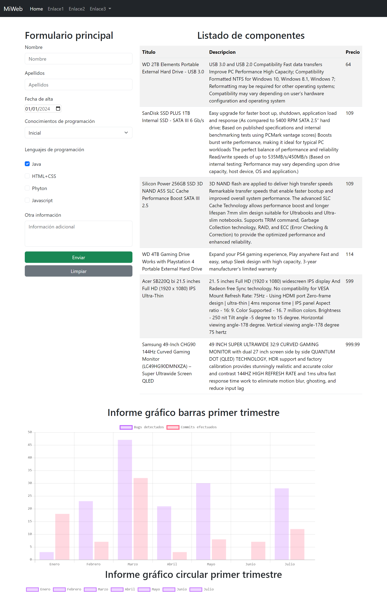

# Práctica 5.3 Uso de APIs web y creación de informes gráficos

El **objetivo** de esta práctica es que el alumnado comprenda el ciclo completo de trabajo con **APIs REST** en el desarrollo web, desde la creación de una **API simulada**, hasta su consumo desde **JavaScript** y la **visualización gráfica de los datos** en informes web.

## Parte 1 Mockoon

Antes de consumir datos desde una API, deberás crear tu propia API REST simulada utilizando la herramienta Mockoon. Esta API será la que posteriormente podrás utilizar en las siguientes partes de la práctica.

La API deberá cumplir, como mínimo, los siguientes requisitos:
- Estar creada con Mockoon.
- Exponer al menos dos **endpoint** accesibles mediante el método GET.
- Devolver datos en formato JSON.
- Contener un conjunto de datos estructurados, por ejemplo:

```json
[
  {
    "id": 1,
    "nombre": "Producto A",
    "categoria": "Categoría 1",
    "precio": 15.99
  }
]
```

Antes de utilizar la API en tu aplicación deberás de probarla en Postman verificando lo siguiente:
- La URL es correcta.
- El endpoint devuelve los datos esperados.
- La respuesta es un JSON válido.


## Parte 2 Generación dinámica de contenido

En esta primera parte deberás utilizar una API para obtener datos dinámicos y mostrarlos en la página web desarrollada en prácticas anteriores con Bootstrap.

Puedes elegir entre:
- Una API real que hayas probado y guardado previamente en Postman.
- Una API propia simulada, creada con Mockoon, que devuelva datos en formato JSON.

Los datos obtenidos de la API deberán mostrarse en alguno de los siguientes formatos (elige al menos uno):
- Una tabla
- Un conjunto de cards
- Una galería
- Campos informativos dentro de la web (listados, bloques de información, etc.)

Para ello:
- Utiliza la instrucción `fetch()` en JavaScript para realizar la petición a la API.
- Procesa correctamente la respuesta HTML con `.json()`.
- Recorrer los datos obtenidos (arrays u objetos) y:
    - Crea dinámicamente los elementos HTML necesarios.
    - Rellena el contenido con los datos proporcionados por la API.
- Insertar los elementos generados dentro de la web utilizando el DOM, por ejemplo:
    - *innerHTML*
    - *appendChild()*
    - *createElement()*


## Parte 3 Revisión de accesibilidad

Es obligatorio revisar y aplicar criterios básicos de accesibilidad, tanto en los nuevos elementos generados dinámicamente como en los existentes:

- Uso correcto de etiquetas semánticas (table, thead, tbody, th, label, etc.).
- Textos alternativos en imágenes si las hubiera.
- Contrastes adecuados y estructura clara.
- Revisión de la accesibilidad del formulario (labels, placeholders, mensajes de error, etc.).

## Parte 4 Visualización de datos con Chart.js

En esta segunda parte deberás representar gráficamente los datos, creando un informe visual que facilite su interpretación (no hace falta que esté relacionados con la tabla que muestras)

Para ello deberás utilizar la librería `chart.js` para crear un **informe gráfico** de los datos de la tabla o con los datos de otra API que decidas.



