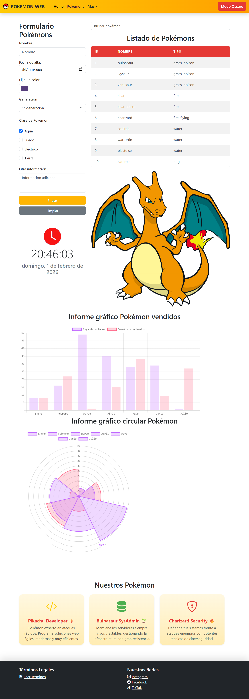

# Práctica 5.3 Creación y consumo de APIs en una web dinámico con visualización de informes gráficos.

El **objetivo** de esta práctica es que el alumnado comprenda el ciclo completo de trabajo con **APIs REST** en el desarrollo web, desde la creación de una **API simulada** usando métodos *GET* y *POST*, hasta su consumo desde **JavaScript** y la **visualización gráfica de los datos** en informes web.

Esta práctica será evaluada para el **proyecto de final de trimestre** junto con la anterior de escritorio creada en Java.

## Parte 1 Mockoon

En esta parte deberás crear tu propia **API REST** simulada utilizando la herramienta **Mockoon**. Esta API será la que posteriormente podrás utilizar en las siguientes partes de la práctica.

La API deberá cumplir, como mínimo, los siguientes requisitos:
- Estar creada con Mockoon.
- Exponer al menos dos **endpoint** accesibles mediante el método **GET**.
- Exponer al menos un **endpoint** accesible mediante el método **POST**.

### Endpoints GET

Deberá devolver datos en formato **JSON** o **imágenes locales** para usar en tu web. 

Así por ejemplo:

```json
[
  {
    "id": 1,
    "nombre": "Producto A",
    "categoria": "Categoría 1",
    "precio": 15.99
  }
]
```

### Endpoint POST

Este endpoint deberá simular un **inicio de sesión** mediante usuario y contraseña. Utilizar reglas básicas en Mockoon (si se desea) para validar usuario y contraseña.

Ejemplo de petición en Postman:

```json
{
  "usuario": "admin",
  "password": "1234"
}

```
Antes de utilizar la API en tu aplicación deberás de probarla en **Postman** verificando lo siguiente:
- Las URL usadas son correctas.
- La respuesta es un JSON válido.
- Los endpoint devuelven los datos o códigos de respuesta esperados.


## Parte 2 Generación dinámica de contenido y login

En esta primera parte deberás utilizar una **API** para obtener **datos dinámicos** y mostrarlos en la página web desarrollada en prácticas anteriores con Bootstrap.

Puedes elegir entre:
- Una **API real** que hayas probado y guardado previamente en Postman.
- Una **API propia simulada**, creada con Mockoon, que devuelva datos en formato JSON.
- Una **mezcla** entre ambas.

Los datos obtenidos de la API deberán mostrarse en alguno de los siguientes formatos (elige al menos uno):
- Una tabla.
- Galería de imágenes.
- Un conjunto de cards.
- Campos informativos dentro de la web (listados, bloques de información, etc.)

Para ello:
- Utiliza la instrucción `fetch()` en JavaScript para realizar la petición a la API.
- Procesa correctamente la respuesta HTML con `.json()`.
- Recorrer los datos obtenidos (arrays u objetos) y:
    - Crea dinámicamente los elementos HTML necesarios.
    - Rellena el contenido con los datos proporcionados por la API.
- Insertar los elementos generados dentro de la web utilizando el **DOM**, por ejemplo:
    - *innerHTML*
    - *appendChild()*
    - *createElement()*

Implementa también un **botón de Login** en la barra de navegación, que permita abrir una **ventana modal** (*Modal Bootstrap*) con un formulario de inicio de sesión, sin recargar la página:
- El botón deberá contener un campo de **usuario**, otro de **contraseña** y un botón de envío.
- Deberá de conectarse con la API creada en el apartado anterior:
  - En caso de respuesta **200**: 
      - Se actualizará la variable de estado.
      - Se cerrará el modal.
      - El botón “Login” cambiará su texto a “Logueado”.
  - En caso de respuesta errónea (401)
      - Tan solo se mostrará un mensaje de error al usuario.

## Parte 3 Revisión de accesibilidad

Es obligatorio revisar y aplicar **criterios básicos de accesibilidad del WCGA2** ♿, tanto en los nuevos elementos generados dinámicamente como en los existentes:

- Uso correcto de etiquetas semánticas (*table, thead, tbody, th, label, etc.*).
- Revisión de la **accesibilidad del formulario** (labels, placeholders, mensajes de error, etc.).
- Textos alternativos en imágenes si las hubiera.
- Contrastes adecuados y estructura clara.
- Test automatizados de accesibilidad.

## Parte 4 Visualización de datos con Chart.js

En esta última parte deberás **representar gráficamente** los datos, creando un informe visual que facilite su interpretación (no hace falta que esté relacionados con la tabla que muestras)

Para ello deberás utilizar la librería `chart.js` para crear un **informe gráfico** de los datos de la tabla o con los datos de otra API que decidas.

En esta web encontrarás la documentación de cómo utilizar dicha librería con ejemplos para ayudarte en su implementación: https://www.chartjs.org/docs/latest/getting-started/



